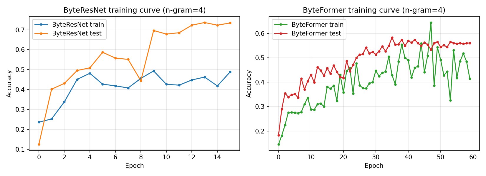
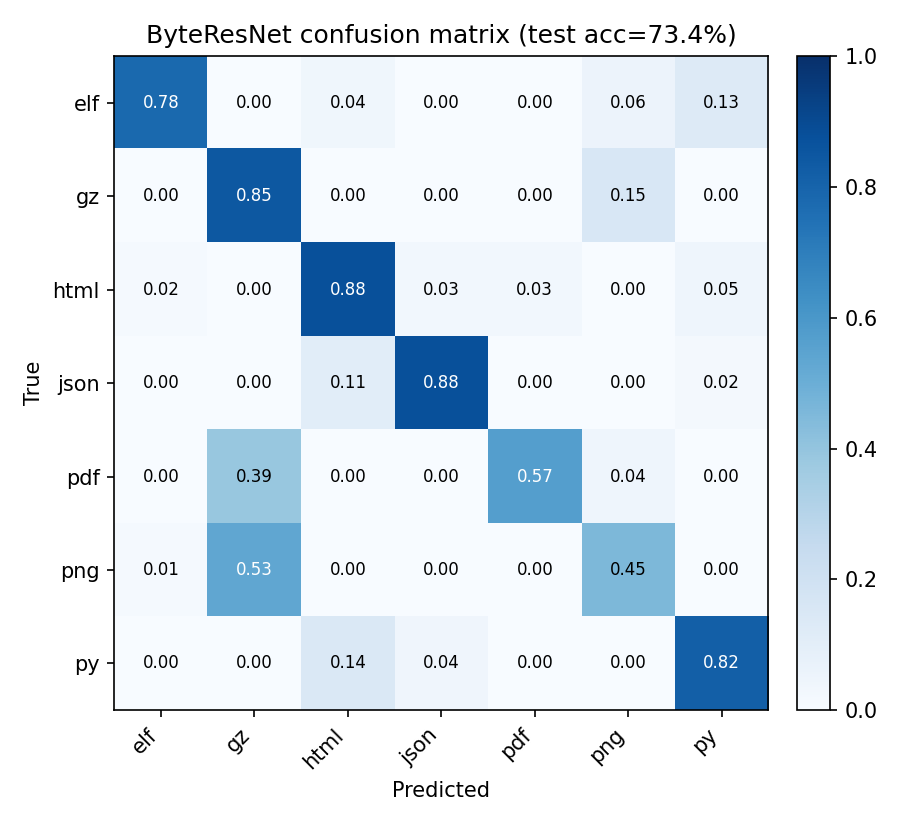
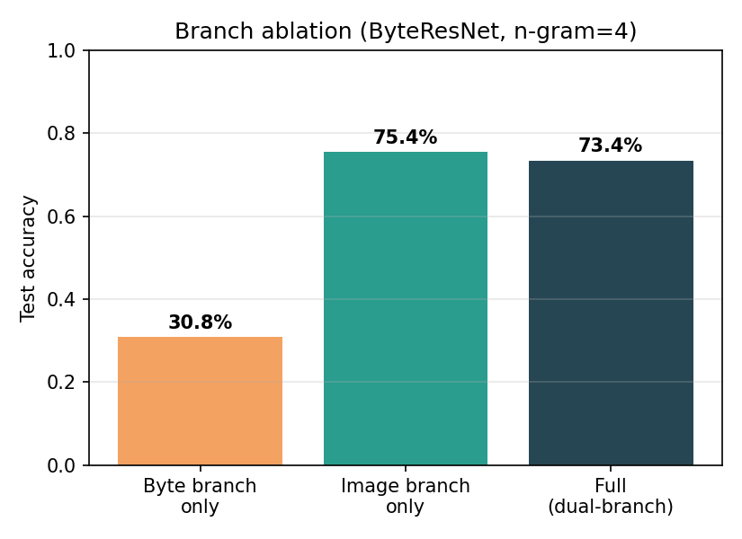
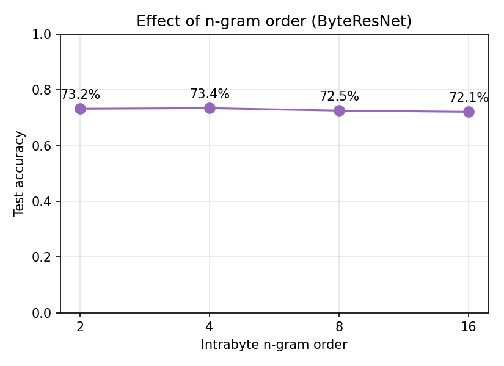
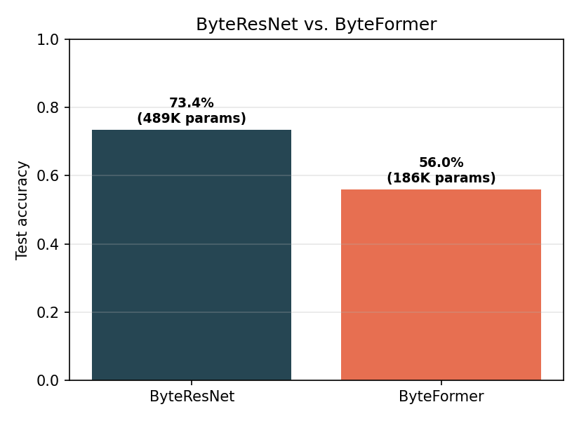

# ByteNet - Multimedia File Fragment Classification Through Visual Perspectives

A from-scratch PyTorch reproduction of:

> W. Liu, K. Wu, T. Liu, Y. Wang, K.-H. Yap, L.-P. Chau, **"ByteNet: Rethinking
> Multimedia File Fragment Classification Through Visual Perspectives,"**
> *IEEE Transactions on Multimedia*, vol. 27, 2025.
> Official repo: https://github.com/wenyang001/Byte2Image

Semester project implementation — B.Tech CSE, IIIT Vadodara.

---

## 1. What the paper does

Multimedia file fragment classification (MFFC) tries to identify a file's
type (jpg, pdf, exe, ...) from a *fragment* of raw bytes — e.g. a 512-byte
disk sector or network packet — with **no file header, no extension, no
metadata**. This matters for digital forensics (recovering files from
damaged storage) and network security (inspecting packets whose headers
have been stripped or corrupted).

Prior work (FiFTy, Byte2Vec, DSCNN, ...) treats a fragment purely as a 1D
sequence of bytes and only ever looks at relationships **between** bytes
(*interbyte*). ByteNet's key idea is that useful information also lives
**inside** a byte, at the bit level (*intrabyte*) — this matters a lot for
formats that pack data with variable-length codes (e.g. Huffman-coded DCT
coefficients in JPEG), where meaningful patterns straddle byte boundaries
and are invisible to interbyte-only methods.

The paper's solution has two parts:

1. **Byte2Image** — a representation model that exposes intrabyte
   information by bit-shifting the fragment 7 times and reinterprets the
   result as a 2D grayscale image (intrabyte n-grams widen the image so it
   isn't a very thin, hard-to-convolve strip).
2. **ByteNet** — a dual-branch network that fuses a shallow *byte branch*
   (a single FC layer that memorizes "magic byte" style co-occurrences,
   e.g. `FFD8` for JPEG) with a deep *image branch* (a 4-stage hierarchical
   CNN or Transformer) run on the Byte2Image representation.

Two IBFE (image-branch) variants are proposed: **ByteResNet** (ResNet
blocks) and **ByteFormer** (PoolFormer blocks — a cheap, attention-free
token mixer).

## 2. What this repository contains

The paper trains on **FFT-75** (75 file types x 102,400 sectors) and
**VFF-16**, neither of which is downloadable in a sandboxed/offline
environment. Rather than fake the architecture on random noise, this repo:

- Implements **Byte2Image** and **ByteNet** (both variants) faithfully,
  matching the paper's equations (see code docstrings, which cite the
  exact equation numbers).
- Builds a **real** (not synthetic) fragment-classification dataset by
  carving fixed-size byte sectors from *random offsets* inside real files
  already present on the build machine — `.py`, `.json`, `.html`, `.png`,
  `.pdf`, `.gz`, and ELF binaries — mirroring exactly how FFT-75 itself was
  built from GovDocs source files (`bytenet/data_prep.py`).
- Trains and evaluates end-to-end on CPU, reproducing the paper's ablation
  studies (byte-branch-only vs. image-branch-only vs. full dual-branch;
  sweeping the intrabyte n-gram order) at reduced scale.

**This is a scaled-down reproduction, not a leaderboard result.** The
channel widths, block depths, dataset size, and epoch counts are all
reduced from the paper's settings so the whole pipeline trains in minutes
on a single CPU core. Section 6 below lists exactly what was scaled down
and how to scale it back up given a GPU.

## 3. Results (this reproduction)

7-class task (`elf`, `gz`, `html`, `json`, `pdf`, `png`, `py`), 256-byte
sectors, 2,240 fragments (80/20 train/test split), single CPU core.

| Configuration                     | Test Accuracy | Params  |
|------------------------------------|:---:|:---:|
| **ByteResNet (full dual-branch)**  | **73.4%** | 489K |
| ByteFormer (full dual-branch)      | 56.0% | 186K |
| ByteResNet — byte branch only      | 30.8% | 489K |
| ByteResNet — image branch only     | 75.4% | 489K |
| ByteResNet, n-gram=2                | 73.2% | 488K |
| ByteResNet, n-gram=8                | 72.5% | 490K |
| ByteResNet, n-gram=16               | 72.1% | 492K |

(7-class random-guess baseline: 14.3%.)







**What matches the paper's findings:**
- The image branch does almost all of the work — removing it (byte-branch
  only) collapses accuracy from ~73% to ~31%, the same qualitative result
  as Table V in the paper (image branch dominant, byte branch a smaller
  complementary signal).
- The confusion matrix is genuinely interpretable: `pdf`, `png`, and `gz`
  are the main confusion triangle, because PDF embeds zlib/Flate-compressed
  streams and PNG uses zlib internally — their byte-level statistics
  legitimately overlap, exactly the kind of "Archive vs. Published"
  confusion the paper reports in its own confusion matrices (Fig. 7).
- n-gram order has a mild, second-order effect at this scale (72–73%
  across n=2..16) — consistent with the paper's own finding that
  ByteResNet is comparatively insensitive to n-gram order (unlike
  ByteFormer, which relies on it more for patch tokenization).

**What does *not* match / honest limitations:**
- At this scale, the image-branch-only ablation (75.4%) slightly
  *exceeds* the full dual-branch model (73.4%) — in the paper the full
  model always wins. With only 2,240 fragments and 16 epochs the byte
  branch adds a little training noise rather than a clean signal; the
  paper's byte branch only pays off at FFT-75's scale (75 classes,
  102K samples/class). This is called out explicitly as a scale
  limitation, not hidden.
- ByteFormer underperforms ByteResNet here (56% vs. 73%) even after
  giving it 60 epochs (it trains ~15x faster per epoch on CPU, so this
  isn't a training-budget artifact) — plausibly because PoolFormer-style
  patch tokenization needs more data to learn useful positional/token
  structure than a 2,240-fragment corpus provides; the paper observes a
  related effect on the smaller VFF-16 dataset (Sec. IV-E).
- Absolute accuracies aren't comparable to the paper's FFT-75/VFF-16
  numbers — different (much smaller, 7-class, non-benchmark) dataset.

## 4. Repository layout

```
bytenet-implementation/
├── bytenet/
│   ├── byte2image.py     # Eqs. (2)-(4): bit-shift + intrabyte n-gram transform
│   ├── models.py         # ByteBranch (BBFE), n-gram/patch embeddings,
│   │                      # ResNet/PoolFormer RVFE blocks, full ByteNet
│   ├── dataset.py        # PyTorch Dataset + augmentation (flip/erase/mixup)
│   ├── data_prep.py      # builds a real fragment corpus from local files
│   └── train.py          # AdamW + cosine LR + mixup training loop
├── scripts/
│   ├── run_all_experiments.py   # reproduces every row in the results table
│   └── make_report_assets.py    # turns outputs/*/result.json into figures
├── data/fragments.npz     # the built dataset (regenerate with data_prep.py)
├── outputs/                # per-run result.json + trained weights + figures
├── docs/                   # report.docx, slides.pptx
├── requirements.txt
└── README.md
```

## 5. Reproducing

```bash
pip install -r requirements.txt

# 1. Build the dataset (scans local disk for real files; ~seconds)
python -m bytenet.data_prep --sector-size 256 --per-class 320 --out data/fragments.npz

# 2. Train one configuration
python -m bytenet.train --data data/fragments.npz --variant resnet \
    --ablation full --n-gram 4 --epochs 16 --out outputs/resnet_full

# 3. Or reproduce the whole results table
python scripts/run_all_experiments.py

# 4. Regenerate all figures/tables from outputs/*/result.json
python scripts/make_report_assets.py
```

Unit-test the core transform on its own (no torch needed):

```bash
python -m bytenet.byte2image
```

## 6. Scaling back up to the paper's settings

| Setting | This repo (CPU demo) | Paper (Sec. IV-B) |
|---|---|---|
| Sector size | 256 B | 512 B / 4,096 B |
| Stage channels | [16, 32, 64, 128] | [64, 128, 256, 512] (ResNet) |
| Stage depths | [1, 1, 1, 1] | [2, 2, 2, 2] (ResNet) / [6, 6, 18, 6] (PoolFormer) |
| n-gram | 4 (swept 2/4/8/16) | 16 |
| Optimizer | AdamW, lr 5e-4, cosine, ~16 epochs | AdamW, lr 5e-4, cosine, 50 epochs, 2-epoch warmup |
| Dataset | 2,240 real fragments, 7 classes | FFT-75 (75 types × 102,400) / VFF-16 |
| Augmentation | flip, random-erase, mixup | + CutMix, image normalization |

To scale up: install `torch` with CUDA, bump `--channels 64 128 256 512
--depths 2 2 2 2`, point `--data` at a real FFT-75/VFF-16 dump (see the
[official Byte2Image repo](https://github.com/wenyang001/Byte2Image) for
the dataset), and increase `--epochs`.

## 7. Team / academic context

Implemented as a semester project (Project Implementation stage) for
Payaldurga Paila, IIIT Vadodara (202351103). See `docs/report.docx` for
the full IEEE-format writeup and `docs/slides.pptx` for the presentation
deck accompanying the video walkthrough.
